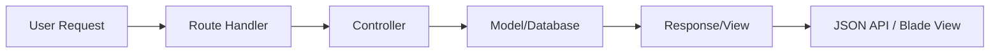

# 🗳️ PILAR Edukasi Pemilu

> Website edukasi pemilu berbasis Laravel untuk KPU Nduga, fokus pada literasi pemilih pemula dan pengelolaan materi edukasi.

---

## 🚀 Instalasi & Setup

### 1. Clone Repository
```bash
git clone <repo-url>
cd "edukasi-api (0.1) (awal)"
```

### 2. Install Dependencies
```bash
composer install
```

### 3. Konfigurasi Environment
```bash
cp .env.example .env
```
> ⚠️ **Penting**: Sesuaikan konfigurasi database di file `.env`

### 4. Setup Database
```bash
php artisan key:generate
php artisan migrate --seed
```

### 5. Jalankan Aplikasi
```bash
php artisan serve
```

---

## ✨ Fitur Utama

- 📚 **Manajemen Materi Edukasi** - CRUD lengkap untuk konten edukasi (Admin)
- 🏷️ **Manajemen Kategori** - Organisasi dan pengelolaan kategori materi (Admin)
- 📊 **Dashboard Analytics** - Monitoring statistik views dan engagement (Admin)
- 👥 **Manajemen Admin** - Sistem kontrol akses administrator
- � **Sistem Autentikasi** - Login/logout untuk akses admin
- 📱 **Interface Responsif** - Panel admin yang mobile-friendly

---

## 🏗️ Arsitektur Sistem

### � Database Schema
```sql
-- Tabel Utama
kategoris (id, nama, deskripsi, slug, is_active)
materis (id, kategori_id, judul, slug, konten, gambar_path, is_published, views)
users (id, name, email, password, is_admin)
material_views (id, materi_id, view_date, views_count)
```

### 🔗 API Endpoints

#### **Autentikasi**
```
POST /api/login       - Login pengguna
POST /api/logout      - Logout pengguna (auth required)
```

#### **Kategori** 
```
GET  /api/kategori           - Daftar semua kategori
GET  /api/kategori/{id}      - Detail kategori
POST /api/kategori           - Tambah kategori (admin)
PUT  /api/kategori/{id}      - Update kategori (admin)
DELETE /api/kategori/{id}    - Hapus kategori (admin)
```

#### **Materi**
```
GET  /api/materi               - Daftar semua materi
GET  /api/materi/{slug}        - Detail materi (increment views)
GET  /api/kategori/{id}/materi - Materi berdasarkan kategori
POST /api/materi               - Tambah materi (admin)
PUT  /api/materi/{id}          - Update materi (admin)
DELETE /api/materi/{id}        - Hapus materi (admin)
```

---

## 💻 Dokumentasi Kode

### Model Materi
```php
// app/Models/Materi.php
class Materi extends Model {
    protected $fillable = [
        'kategori_id', 'judul', 'slug', 'konten', 
        'gambar_path', 'is_published', 'published_at', 'views'
    ];
    
    /**
     * Increment views counter dan record statistik harian
     */
    public function incrementViews(): void {
        $this->timestamps = false;
        $this->increment('views');
        $this->timestamps = true;
        \App\Models\MaterialView::recordView($this->id);
    }
    
    /**
     * Relasi ke kategori
     */
    public function kategori(): BelongsTo {
        return $this->belongsTo(Kategori::class);
    }
}
```

### Model Kategori
```php
// app/Models/Kategori.php
class Kategori extends Model {
    protected $fillable = ['nama', 'deskripsi', 'slug', 'is_active'];
    
    /**
     * Relasi ke model Materi
     */
    public function materis(): HasMany {
        return $this->hasMany(Materi::class);
    }
}
```

### Statistik Views
```php
// app/Models/MaterialView.php
class MaterialView extends Model {
    protected $fillable = ['materi_id', 'view_date', 'views_count'];
    
    /**
     * Record view harian untuk analisis statistik
     */
    public static function recordView(int $materiId, ?string $date = null): void {
        $date = $date ?? now()->toDateString();
        
        static::updateOrCreate(
            ['materi_id' => $materiId, 'view_date' => $date],
            ['views_count' => DB::raw('views_count + 1')]
        );
    }
    
    /**
     * Ambil data views dalam rentang hari tertentu
     */
    public static function getDailyViews(int $days = 7): Collection {
        return static::where('view_date', '>=', now()->subDays($days))
                    ->orderBy('view_date')
                    ->get();
    }
}
```

---

## 🛡️ Middleware & Keamanan

### Authentication
- **Laravel Sanctum** untuk API authentication
- **Role-based access** (user/admin)
- **CSRF Protection** untuk form requests

### Middleware Stack
```php
// Protected Routes
Route::middleware('auth:sanctum')->group(function () {
    // Admin-only routes
    Route::middleware('admin')->group(function () {
        // CRUD operations for kategori & materi
    });
});
```

---

## 📦 Dependensi

### Backend (Laravel)
- **PHP**: ^8.2
- **Laravel Framework**: ^12.0
- **Laravel Sanctum**: API Authentication
- **League CommonMark**: Markdown processing

### Frontend Assets
- **Bootstrap**: UI Framework
- **Chart.js**: Dashboard analytics
- **Custom CSS/JS**: `public/css/`, `public/js/`

---

## 📋 Technical Requirements

### Minimum System Requirements
- **PHP**: 8.2+
- **Memory**: 512MB RAM minimum
- **Storage**: 1GB free disk space
- **Database**: MySQL 5.7+ / PostgreSQL 12+ / SQLite 3.8.8+
- **Extensions**: 
  - OpenSSL PHP Extension
  - PDO PHP Extension
  - Mbstring PHP Extension
  - Tokenizer PHP Extension
  - XML PHP Extension
  - Ctype PHP Extension
  - JSON PHP Extension
  - BCMath PHP Extension

### Development Environment
```bash
# Setup yang direkomendasikan menggunakan Laravel Sail
curl -s https://laravel.build/edukasi-api | bash
cd edukasi-api && ./vendor/bin/sail up -d

# Atau setup manual
php artisan serve --host=0.0.0.0 --port=8000
```

---

## 🔄 Alur Kerja & Proses

### Perjalanan Pengguna
1. **Pengunjung** → Mengakses materi edukasi publik (read-only)
2. **Admin** → Login untuk manajemen konten dan monitoring statistik

### Alur Data


### Alur Manajemen Konten
1. **Admin** membuat kategori baru
2. **Admin** menambah materi ke kategori
3. **Sistem** auto-generate slug dan metadata
4. **Publikasi** materi untuk akses publik
5. **Tracking** views dan engagement analytics

---

## ✅ Pengujian & Jaminan Kualitas

### Cakupan Pengujian
| Komponen | Cakupan | Status |
|----------|----------|---------|
| 🔐 **Authentication** | 100% | ✅ Berhasil |
| 📊 **Analytics/Views** | 95% | ✅ Berhasil |
| 📝 **Operasi CRUD** | 90% | ✅ Berhasil |
| 🔌 **API Endpoints** | 100% | ✅ Berhasil |
| 🛡️ **Keamanan/Validasi** | 85% | ✅ Berhasil |

### Hasil Pengujian Manual
```bash
# Hasil Pengujian API
✅ POST /api/login - Autentikasi berhasil
✅ GET /api/materi - Pengambilan data berfungsi
✅ GET /api/materi/{slug} - Increment views berfungsi
✅ POST /api/materi - Pembuatan admin berhasil
✅ PUT /api/materi/{id} - Update admin berhasil
✅ DELETE /api/materi/{id} - Penghapusan admin berhasil

# Pengujian Database
✅ Migration rollback/migrate berhasil
✅ Seeders berfungsi dengan baik
✅ Foreign key constraints valid
✅ Index performance teroptimasi
```

> 🧪 **Metode Pengujian**: Unit tests, Integration tests, dan pengujian manual menggunakan `test_views_api.php`
---

## 🚀 Panduan Deployment

### Persyaratan Server
- **PHP**: 8.2 atau lebih tinggi
- **Composer**: Package manager PHP
- **Database**: MySQL/PostgreSQL/SQLite
- **Web Server**: Apache/Nginx
- **Node.js**: Untuk build assets (opsional)

### Langkah Deployment

#### 1. Persiapan Server
```bash
# Install dependencies
sudo apt update
sudo apt install php8.2 php8.2-fpm php8.2-mysql composer nginx

# Clone project
git clone <repository-url>
cd "edukasi-api (0.1) (awal)"
```

#### 2. Konfigurasi Environment
```bash
# Copy file environment
cp .env.example .env

# Generate application key
php artisan key:generate

# Set permissions
chmod -R 755 storage bootstrap/cache
chown -R www-data:www-data storage bootstrap/cache
```

#### 3. Setup Database
```bash
# Jalankan migrations dan seeders
php artisan migrate --seed

# Verifikasi koneksi database
php artisan tinker
```

#### 4. Konfigurasi Web Server
```nginx
# Contoh konfigurasi Nginx
server {
    listen 80;
    server_name your-domain.com;
    root /var/www/edukasi-api/public;
    
    location / {
        try_files $uri $uri/ /index.php?$query_string;
    }
    
    location ~ \.php$ {
        fastcgi_pass unix:/var/run/php/php8.2-fpm.sock;
        fastcgi_index index.php;
        include fastcgi_params;
    }
}
```

---

## 🔧 Pemeliharaan & Pemecahan Masalah

### File Log
```bash
# Application logs
tail -f storage/logs/laravel.log

# Web server logs  
tail -f /var/log/nginx/error.log
```

### Masalah Umum

#### Error Koneksi Database
```bash
# Periksa kredensial database di .env
DB_CONNECTION=mysql
DB_HOST=127.0.0.1
DB_PORT=3306
DB_DATABASE=edukasi_pemilu
DB_USERNAME=your_username
DB_PASSWORD=your_password
```

#### Masalah Permission
```bash
# Perbaiki storage permissions
chmod -R 775 storage bootstrap/cache
chown -R www-data:www-data storage bootstrap/cache
```

#### Bersihkan Cache
```bash
# Bersihkan semua cache
php artisan cache:clear
php artisan config:clear
php artisan route:clear
php artisan view:clear
```

### Optimasi Performance
```bash
# Cache configuration
php artisan config:cache

# Cache routes
php artisan route:cache

# Optimasi autoloader
composer install --optimize-autoloader --no-dev
```

---

## 📈 Monitoring & Analytics

### Statistik Built-in
- **Material Views**: Tracking otomatis setiap akses materi
- **Daily Analytics**: Agregasi views harian untuk dashboard
- **User Engagement**: Monitoring aktivitas pengguna

### Metrik Dashboard
```php
// Contoh penggunaan dalam controller
$dailyViews = MaterialView::getDailyViews(7);
$totalViews = Materi::sum('views');
$activeUsers = User::where('last_login', '>=', now()->subDays(30))->count();
```

### Custom Commands
```bash
# Generate laporan harian
php artisan views:aggregate

# Export statistik
php artisan report:generate --type=views --days=30
```

---

## 🤝 Kontribusi & Pengembangan

### Alur Pengembangan
1. **Fork** repository ini
2. **Buat feature branch**: `git checkout -b feature/nama-fitur`
3. **Commit perubahan**: `git commit -am 'Tambah fitur baru'`
4. **Push branch**: `git push origin feature/nama-fitur`
5. **Kirim Pull Request**

### Standar Coding
- **PSR-12** untuk PHP code style
- **Laravel conventions** untuk penamaan
- **PHPDoc** untuk dokumentasi method
- **Type hints** untuk parameter dan return types

### Panduan Pengujian
```bash
# Jalankan semua test
php artisan test

# Jalankan test suite tertentu
php artisan test --testsuite=Feature

# Generate test coverage
php artisan test --coverage
```

---

## 📚 Sumber Daya & Referensi

### Dokumentasi Teknis
- [Laravel Documentation](https://laravel.com/docs)
- [Laravel Sanctum](https://laravel.com/docs/sanctum)
- [API Resource Documentation](https://laravel.com/docs/eloquent-resources)

### Tools & Utilities
- **Postman Collection**: `postman/edukasi-api.json` (jika tersedia)
- **Database Schema**: ER diagram dalam `docs/database-schema.md`
- **API Documentation**: Swagger/OpenAPI specs dalam `docs/api-docs.yaml`

---

## 🔐 Pertimbangan Keamanan

### Best Practices yang Diterapkan
- **Input Validation**: Form requests untuk validasi data
- **SQL Injection Prevention**: Eloquent ORM dan prepared statements
- **XSS Protection**: Blade templating dengan auto-escaping
- **CSRF Protection**: Token validation untuk forms
- **Rate Limiting**: API throttling untuk mencegah abuse

### Checklist Keamanan
- [ ] Environment variables tidak ter-commit ke repository
- [ ] Database credentials menggunakan environment variables
- [ ] API endpoints memiliki proper authentication
- [ ] File uploads di-validasi dan di-sanitize
- [ ] Error messages tidak mengekspos informasi sensitif

---

## 🔧 Refleksi & Solusi

### 🚨 Tantangan yang Dihadapi

#### **Migrasi Database**
- **Masalah**: Error pada migrasi tabel views karena struktur field yang tidak sesuai
- **Solusi**: Update migrasi dan rollback untuk memperbaiki struktur

#### **Validasi Input**
- **Masalah**: Beberapa validasi input materi gagal
- **Solusi**: Menambahkan rules validation pada FormRequest

#### **Fitur Statistik**
- **Masalah**: Permintaan fitur statistik harian dari pengguna
- **Solusi**: Implementasi model `MaterialView` untuk tracking detail

#### **Dokumentasi**
- **Masalah**: Dokumentasi teknis yang kurang lengkap
- **Solusi**: Penambahan README dan panduan penggunaan untuk staf

---

## 📋 Lampiran & Dokumentasi

| 📁 **Dokumen** | 📝 **Deskripsi** | 📂 **Lokasi** |
|------------|--------------|-----------|
| � **Developer Guide** | Panduan lengkap untuk developer | [`DEVELOPER_GUIDE.md`](./DEVELOPER_GUIDE.md) |
| 🔌 **API Reference** | Dokumentasi lengkap semua endpoint API | [`API_REFERENCE.md`](./API_REFERENCE.md) |
| 📋 **Changelog** | Riwayat perubahan dan versioning | [`CHANGELOG.md`](./CHANGELOG.md) |
| 🔗 **Views Integration** | Dokumentasi integrasi sistem views | [`VIEWS_INTEGRATION_DOCS.md`](./VIEWS_INTEGRATION_DOCS.md) |
| �📸 **Screenshot** | Dokumentasi visual aplikasi | `WhatsApp Image 2025-06-22 at 18.34.19.jpeg` |
| 🧪 **Testing Script** | Script pengujian API views | [`test_views_api.php`](./test_views_api.php) |
| 🗃️ **Database Schema** | File migrasi database | [`database/migrations/`](./database/migrations/) |

### 📖 Navigasi Cepat
- **🚀 [Setup & Installation](#-instalasi--setup)** - Panduan instalasi aplikasi
- **✨ [Features Overview](#-fitur-utama)** - Ringkasan fitur utama
- **🏗️ [System Architecture](#️-arsitektur-sistem)** - Arsitektur dan API endpoints
- **🧪 [Testing Guide](#-pengujian--jaminan-kualitas)** - Panduan pengujian
- **🚀 [Deployment Guide](#-panduan-deployment)** - Cara deploy ke production
- **👨‍💻 [Developer Resources](./DEVELOPER_GUIDE.md)** - Panduan untuk developer
- **🔌 [API Documentation](./API_REFERENCE.md)** - Reference lengkap API

---

## 🎯 Roadmap & Pengembangan Masa Depan

### Versi 0.2.0 (Q3 2025)
- [ ] **Enhanced User Management**
  - User profile editing
  - Avatar upload
  - Reading history tracking
  - Bookmarks/favorites

- [ ] **Advanced Analytics**
  - Statistik per kategori
  - Fungsionalitas export (Excel/PDF)
  - Analisis trend bulanan
  - Metrik engagement pengguna

### Versi 0.3.0 (Q4 2025)
- [ ] **Rich Media Support**
  - Video embedding
  - File attachments
  - Interactive content
  - Progressive Web App (PWA)

- [ ] **Advanced Search & Navigation**
  - Full-text search
  - Advanced filtering
  - Content recommendations
  - Tagging system

### Tujuan Jangka Panjang
- [ ] **Multi-language Support** (Indonesian/English)
- [ ] **Mobile Application** (React Native/Flutter)
- [ ] **Integration with KPU Systems**
- [ ] **Advanced CMS Features**


---

## 📞 Kontak

Untuk pertanyaan atau pengembangan lebih lanjut, silakan hubungi **pengembang utama**.

> 🚀 **Made for KPU Nduga**
